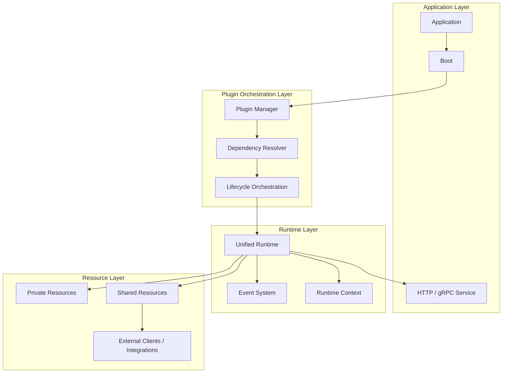
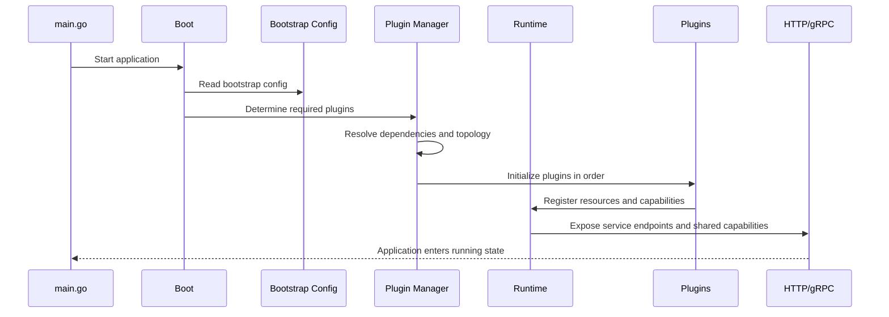

# Lynx Framework Architecture

This page focuses on how Go-Lynx organizes applications, plugins, and resources **at runtime**.

If the design page answers “why Lynx is shaped this way”, the architecture page answers “what layers exist at runtime, and how those layers cooperate”.

## Current Architectural View

The most useful current view is no longer “a framework built around one middleware stack”. It is better described as four layers:

1. **application layer**: app entry, bootstrap shell, service process, control-plane-facing helpers
2. **plugin orchestration layer**: registration, dependency resolution, topology ordering, lifecycle scheduling
3. **runtime layer**: resource exposure, event flow, context propagation, unified assembly
4. **resource layer**: private resources, shared resources, external clients, governance-facing objects

## Layered Runtime View

## Startup Flow

From a startup-order perspective, the common path can be summarized like this:

## Why This Matters For The Plugin Ecosystem

Without this runtime structure, plugins would quickly degrade into a collection of unrelated SDKs. What the Lynx architecture enforces is:

- plugins are initialized with ordering and dependency rules
- plugins do not each own the entire world; resource boundaries are managed centrally
- plugins do not need to hard-code direct coupling everywhere; they can collaborate through resource and event models

That is the architectural basis for a growing official module family.

## What You Usually Feel In Business Code

Most teams do not feel this architecture as a diagram. They feel it as outcomes:

- startup paths become more stable
- adding a plugin does not require inventing a new bootstrap flow
- resource access follows a more consistent model
- part of the startup ordering and boundary management moves out of application code

## Continue Reading

If this layer model makes sense, the next useful pages are:

- [Design Philosophy](/docs/intro/design)
- [Bootstrap Configuration](/docs/getting-started/bootstrap-config)
- [Plugin Management](/docs/getting-started/plugin-manager)
- [Plugin Ecosystem](/docs/existing-plugin/plugin-ecosystem)
