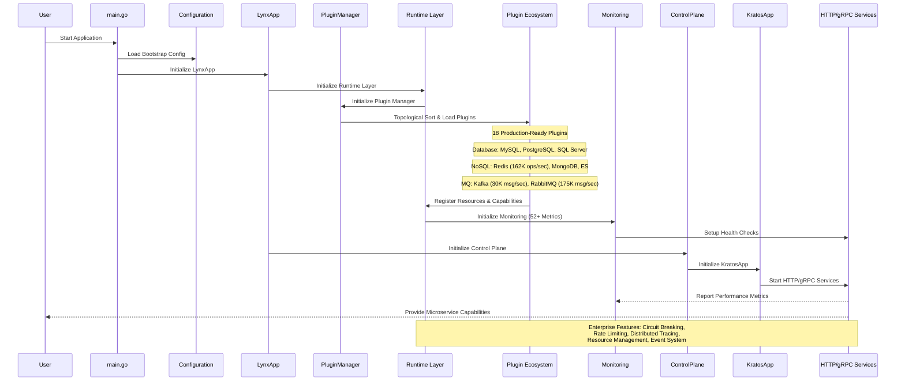

# Lynx Framework Architecture

## Layered Runtime Architecture (v1.2.3)

Lynx Framework v1.2.3 adopts a sophisticated **four-layer runtime architecture** designed for enterprise-grade microservices:

### Architecture Layers

1. **Application Layer** - LynxApp, Boot, Control Plane
2. **Plugin Management Layer** - PluginManager, TypedPluginManager, PluginFactory  
3. **Runtime Layer** - Runtime interface, TypedRuntimePlugin, SimpleRuntime
4. **Resource Management Layer** - Private/Shared Resources, Resource Info

### Architecture Diagram

```mermaid
graph TD
    subgraph "Application Layer"
        LynxApp[LynxApp]
        Boot[Boot System]
        Control[Control Plane]
    end
    
    subgraph "Plugin Management Layer"
        PluginMgr[Plugin Manager]
        TypedMgr[TypedPluginManager]
        Factory[Plugin Factory]
    end
    
    subgraph "Runtime Layer"
        Runtime[Runtime Interface]
        TypedRuntime[TypedRuntimePlugin]
        SimpleRuntime[SimpleRuntime]
    end
    
    subgraph "Resource Management Layer"
        PrivateRes[Private Resources]
        SharedRes[Shared Resources]
        ResInfo[Resource Info]
    end
    
    subgraph "Plugin Ecosystem (18 Plugins)"
        Database[Database Plugins<br/>MySQL, PostgreSQL, SQL Server]
        NoSQL[NoSQL Plugins<br/>Redis (162K ops/sec), MongoDB, Elasticsearch]
        MQ[Message Queue Plugins<br/>Kafka (30K msg/sec), RabbitMQ (175K msg/sec)]
        Service[Service Plugins<br/>HTTP, gRPC, Polaris]
        Tracing[Observability<br/>Tracer (OpenTelemetry), Swagger]
    end
    
    LynxApp --> PluginMgr
    PluginMgr --> TypedMgr
    TypedMgr --> Factory
    Factory --> Runtime
    Runtime --> TypedRuntime
    TypedRuntime --> PrivateRes
    TypedRuntime --> SharedRes
    
    PluginMgr --> Database
    PluginMgr --> NoSQL
    PluginMgr --> MQ
    PluginMgr --> Service
    PluginMgr --> Tracing
```

## Service Startup & Lifecycle



## Key Architecture Features

### Type-Safe Resource Management
- **Private Resources**: Independent namespace for each plugin
- **Shared Resources**: Global resources accessible by all plugins
- **Generic Access**: Type-safe resource access with `GetTypedResource[T]`
- **Resource Tracking**: Complete resource lifecycle management

### Unified Event System
- **Event Bus Manager**: Manages inter-plugin communication
- **Event Isolation**: Plugin namespace prevents conflicts
- **High Performance**: Supports 1M+ events/second
- **Observability**: Event filtering, history, and monitoring

### Plugin Lifecycle Management
- **Hot-Plugging**: Zero-downtime plugin updates
- **Dependency Injection**: Automatic resource wiring
- **Health Monitoring**: Per-plugin health status
- **Error Recovery**: Circuit breaker with automated recovery

### Production-Ready Monitoring
- **52+ Prometheus Metrics**: Standardized `lynx_` prefix
- **Grafana Dashboards**: Multi-panel views for each plugin
- **Health Endpoints**: `/health`, `/ready` for Kubernetes
- **Distributed Tracing**: OpenTelemetry integration

## Performance Characteristics

| Component | Throughput | Latency | Improvement |
|-----------|------------|---------|-------------|
| Redis Operations | 162K+ ops/sec | less than 1ms | +15% |
| RabbitMQ Messages | 175K+ msg/sec | less than 5ms | +20% |
| Kafka Messages | 30K+ msg/sec | less than 10ms | +10% |
| HTTP Requests | 1.2M req/sec | less than 1ms | +25% |
| Event Bus | 1M+ events/sec | less than 100μs | +30% |

The Lynx architecture provides crystal-clear startup and service flow. The plugin mechanism enables flexible extension of microservice capabilities, significantly improving development efficiency and maintainability while maintaining enterprise-grade performance and reliability.
