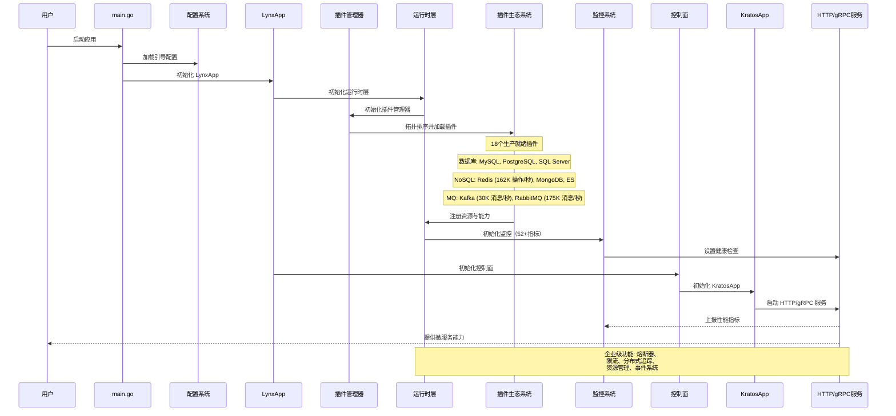

# Lynx 框架架构

## 分层运行时架构（v1.2.3）

Lynx Framework v1.2.3 采用了为企业级微服务设计的精密**四层运行时架构**：

### 架构层次

1. **应用层** - LynxApp、Boot、控制面
2. **插件管理层** - PluginManager、TypedPluginManager、PluginFactory  
3. **运行时层** - Runtime 接口、TypedRuntimePlugin、SimpleRuntime
4. **资源管理层** - 私有/共享资源、资源信息

### 架构图

```mermaid
graph TD
    subgraph "应用层"
        LynxApp[LynxApp]
        Boot[启动系统]
        Control[控制面]
    end
    
    subgraph "插件管理层"
        PluginMgr[插件管理器]
        TypedMgr[类型化插件管理器]
        Factory[插件工厂]
    end
    
    subgraph "运行时层"
        Runtime[运行时接口]
        TypedRuntime[类型化运行时插件]
        SimpleRuntime[简单运行时]
    end
    
    subgraph "资源管理层"
        PrivateRes[私有资源]
        SharedRes[共享资源]
        ResInfo[资源信息]
    end
    
    subgraph "插件生态系统（18个插件）"
        Database[数据库插件<br/>MySQL, PostgreSQL, SQL Server]
        NoSQL[NoSQL插件<br/>Redis (162K 操作/秒), MongoDB, Elasticsearch]
        MQ[消息队列插件<br/>Kafka (30K 消息/秒), RabbitMQ (175K 消息/秒)]
        Service[服务插件<br/>HTTP, gRPC, Polaris]
        Tracing[可观测性<br/>Tracer (OpenTelemetry), Swagger]
    end
    
    LynxApp --> PluginMgr
    PluginMgr --> TypedMgr
    TypedMgr --> Factory
    Factory --> Runtime
    Runtime --> TypedRuntime
    TypedRuntime --> PrivateRes
    TypedRuntime --> SharedRes
    
    PluginMgr --> Database
    PluginMgr --> NoSQL
    PluginMgr --> MQ
    PluginMgr --> Service
    PluginMgr --> Tracing
```

## 服务启动与生命周期



## 关键架构特性

### 类型安全的资源管理
- **私有资源**: 每个插件独立的命名空间
- **共享资源**: 所有插件可访问的全局资源
- **泛型访问**: 使用 `GetTypedResource[T]` 的类型安全访问
- **资源跟踪**: 完整的资源生命周期管理

### 统一事件系统
- **事件总线管理器**: 管理插件间通信
- **事件隔离**: 插件命名空间防止冲突
- **高性能**: 支持每秒100万+事件
- **可观测性**: 事件过滤、历史和监控

### 插件生命周期管理
- **热插拔**: 零停机时间插件更新
- **依赖注入**: 自动资源装配
- **健康监控**: 按插件健康状态
- **错误恢复**: 带自动恢复的熔断器

### 生产就绪监控
- **52+个 Prometheus 指标**: 标准化 `lynx_` 前缀
- **Grafana 仪表板**: 每个插件的多面板视图
- **健康端点**: `/health`、`/ready` 用于 Kubernetes
- **分布式追踪**: OpenTelemetry 集成

## 性能特性

| 组件 | 吐量 | 延迟 | 改进 |
|------|------|------|------|
| Redis操作 | 162K+ 操作/秒 | 小于1ms | +15% |
| RabbitMQ消息 | 175K+ 消息/秒 | 小于5ms | +20% |
| Kafka消息 | 30K+ 消息/秒 | 小于10ms | +10% |
| HTTP请求 | 1.2M 请求/秒 | 小于1ms | +25% |
| 事件总线 | 1M+事件/秒 | 小于100μs | +30% |

Lynx 架构提供了清晰的启动和服务流程。插件机制让微服务能力灵活扩展，在保持企业级性能和可靠性的同时，极大提升开发效率与可维护性。 