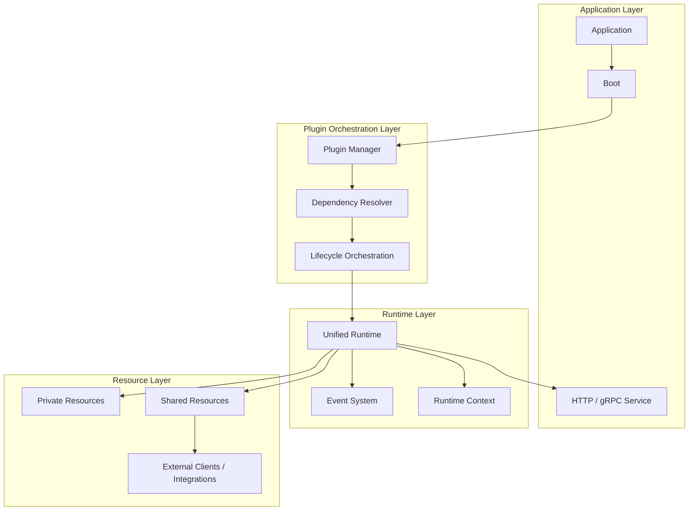
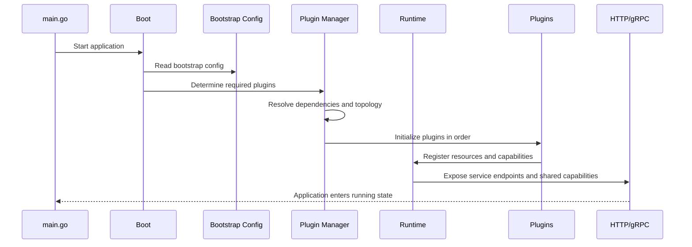

# Lynx 框架架构

本页聚焦 Lynx 在**运行时**如何组织应用、插件和资源。

如果设计页回答的是“为什么 Lynx 会长成现在这样”，那么架构页回答的就是“运行时有哪些层，以及这些层如何协作”。

## 当前架构视图

当前最有用的理解方式，已经不再是“围绕某套中间件堆起来的框架”，而更适合描述为四层：

1. **应用层**：应用入口、引导壳层、服务进程、面向控制面的辅助能力
2. **插件编排层**：注册、依赖解析、拓扑排序、生命周期调度
3. **运行时层**：资源暴露、事件流、上下文传播、统一装配
4. **资源层**：私有资源、共享资源、外部客户端、面向治理的对象

## 分层运行时视图

```mermaid
graph TD
    subgraph "Application Layer"
        App[Application]
        Boot[Boot]
        Service[HTTP / gRPC Service]
    end

    subgraph "Plugin Orchestration Layer"
        Manager[Plugin Manager]
        Resolver[Dependency Resolver]
        Lifecycle[Lifecycle Orchestration]
    end

    subgraph "Runtime Layer"
        Runtime[Unified Runtime]
        Events[Event System]
        Context[Runtime Context]
    end

    subgraph "Resource Layer"
        Private[Private Resources]
        Shared[Shared Resources]
        External[External Clients / Integrations]
    end

    App --> Boot
    Boot --> Manager
    Manager --> Resolver
    Resolver --> Lifecycle
    Lifecycle --> Runtime
    Runtime --> Events
    Runtime --> Context
    Runtime --> Private
    Runtime --> Shared
    Shared --> External
    Runtime --> Service
```

## 启动流程

从启动顺序的角度看，常见路径可以概括为：

```mermaid
sequenceDiagram
    participant Main as main.go
    participant Boot as Boot
    participant Config as Bootstrap Config
    participant Manager as Plugin Manager
    participant Runtime as Runtime
    participant Plugins as Plugins
    participant Service as HTTP/gRPC

    Main->>Boot: Start application
    Boot->>Config: Read bootstrap config
    Boot->>Manager: Determine required plugins
    Manager->>Manager: Resolve dependencies and topology
    Manager->>Plugins: Initialize plugins in order
    Plugins->>Runtime: Register resources and capabilities
    Runtime->>Service: Expose service endpoints and shared capabilities
    Service-->>Main: Application enters running state
```

如果对应到当前代码，这段流程大致意味着：

- 插件模块通过 `factory.GlobalTypedFactory().RegisterPlugin(...)` 完成注册
- `TypedPluginManager` 负责准备和初始化受管理插件实例
- 插件通过 `InitializeResources`、`StartupTasks`、`CleanupTasks` 等 hook 参与生命周期
- 运行时持有的资源再被服务层或业务代码消费

## 为什么这对插件生态重要

如果没有这样的运行时结构，插件很快就会退化成一堆互不关联的 SDK。Lynx 架构真正约束的是：

- 插件按顺序和依赖规则完成初始化
- 插件不会各自“各管一摊”，资源边界由中心化运行时管理
- 插件不需要到处写死直接耦合，可以通过资源和事件模型协作

这也是为什么有些能力会暴露成插件 Getter，而另一些能力则需要通过 `http.server`、`grpc.service`、`apollo.config.center`、`sentinel.flow_control` 这样的 plugin-manager 名称来获取。

这正是官方模块家族可以持续扩展的架构基础。

## 你在业务代码里通常感受到的是什么

大多数团队不会以“图”的形式感知这套架构，而是以结果感知它：

- 启动路径更稳定
- 新增插件不需要再发明一套新的引导流程
- 资源访问方式更一致
- 一部分启动顺序和边界管理从应用代码中被抽离出来

## 继续阅读

如果你已经接受这套分层模型，接下来最有价值的页面是：

- [设计理念](/docs/intro/design)
- [引导配置](/docs/getting-started/bootstrap-config)
- [插件管理](/docs/getting-started/plugin-manager)
- [插件生态](/docs/existing-plugin/plugin-ecosystem)
