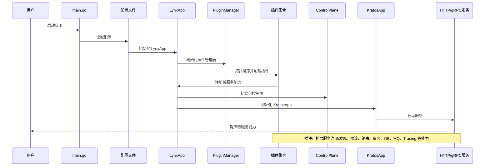

```mermaid
sequenceDiagram
  participant User as 用户
  participant Main as main.go
  participant Config as 配置文件
  participant LynxApp as LynxApp
  participant PluginMgr as PluginManager
  participant Plugins as 插件集合
  participant Control as ControlPlane
  participant Kratos as KratosApp
  participant Service as HTTP/gRPC服务

  User->>Main: 启动应用
  Main->>Config: 读取配置
  Config->>LynxApp: 初始化 LynxApp
  LynxApp->>PluginMgr: 初始化插件管理器
  PluginMgr->>Plugins: 拓扑排序并加载插件
  Plugins->>LynxApp: 注册微服务能力
  LynxApp->>Control: 初始化控制面
  LynxApp->>Kratos: 初始化 KratosApp
  Kratos->>Service: 启动服务
  Service-->>User: 提供微服务能力
  Note over Plugins,Service: 插件可扩展服务注册/发现、限流、路由、事务、DB、MQ、Tracing 等能力
```
